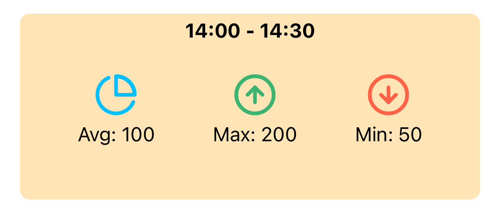

# Latus Group React Native Tech Test

This tech test is designed to assess a small range of your React Native
knowledge. You should spend no more than 2 hours on this task.

## The challenge

You've been asked to create a component to display data of the following
shape:

```json
{
  "data": [
    {
      "from": "2018-01-20T12:00Z",
      "to": "2018-01-20T12:30Z",
      "intensity": {
        "max": 320,
        "average": 266,
        "min": 180,
        "index": "moderate"
    }
  }]
}
```

The following design has been provided for a single item from the array:



> [!NOTE]
> A `Card` component has already been created, and can be reused in your
> component.

> [!NOTE]
> The above example uses the `Feathers` icon set

### Must haves

- An item component that matches the designs
- A screen that displays any number of the above component
- Appropriate tests for any components created

### Nice to haves

- Appropriate stories for any components created

## Storybook

To run `Storybook` on your simulator, run the appropriate script:

- `npm run storybook:ios` for iOS simulator
- `npm run storybook:android` for Android simulator
